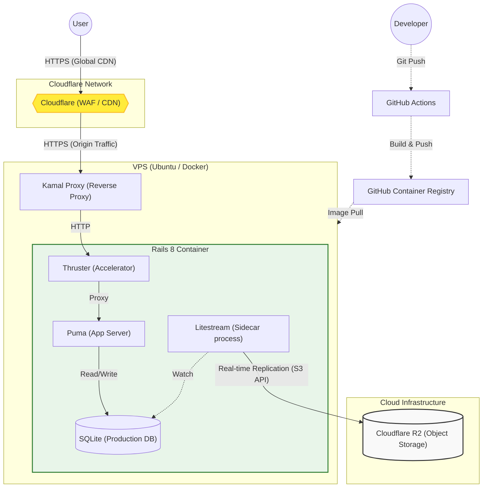

[](https://github.com/php8-study/php8-study-app/actions/workflows/ci.yml)
[](https://github.com/php8-study/php8-study-app/actions/workflows/deploy.yml)


# PHP8技術者認定初級試験スタディ


## 概要

PHP8技術者認定初級試験スタディはPHP8技術者認定初級試験を受験する人に向けた、学習サポートアプリです。

## 特徴

PHP8技術者認定初級試験の公式認定教材である 独習PHP 第4版 の解説内容を参考に200問以上の問題を学習することが出来ます。

- **ランダム演習**: 全問題からランダムに出題され、手軽に学習できます。
- **模擬試験**: 実際の試験と同じ配分・問題数で出題されます。
- **成績管理**: 模擬試験の受験結果や履歴を記録・管理できます。
- **管理機能**: 管理者は問題・カテゴリーを作成、変更、削除することができます。

## 著作権およびコンテンツについて

本アプリのコンテンツ作成にあたっては、著作権法を遵守し、以下のポリシーで運用しています。

- **問題の独自性**: 掲載問題は公式教材（独習PHP 第4版）を参考に作者が独自に作成したものです。教材からの転載・複写は一切ありません。
- **引用・参照の範囲**: 各問題に記載したテキストのページ番号は、学習補助（索引）としての利用を目的としています。
- **非公式ツール**: 個人開発の非公式アプリであり、試験主催団体および出版社とは一切関係ありません。

## URL

https://php8-study.jp

## デモ

https://github.com/user-attachments/assets/fb7f8155-8dd8-4c31-b06c-114b6220fb6a

## 環境構築

以下の手順でローカル環境を構築できます。

1. リポジトリのクローンとセットアップ

```bash
$ git clone https://github.com/php8-study/php8-study-app.git
$ cd php8-study-app/
$ bin/setup
```

2.アプリケーションの起動

```bash
$ bin/dev
```

## ログイン

### 開発用ログイン (認証バイパス)

開発環境においては、GitHub連携を行わずにワンクリックでログインできる開発者ツールが実装されています。

1. `bin/dev`でサーバーを起動し、`http://localhost:3000/`にアクセスします。
2. **画面最下部に固定表示されている黒いバー**を確認してください。
3. 「👑管理者」または「👤一般」をクリックすると、それぞれの権限で即座にログインできます。

- 動作確認の際はこちらの使用を推奨します。

### 本番用ログイン (GitHub OAuth)

1. `.env` ファイルに、GitHub Developer Settings で取得した以下のキーを設定してください。

```bash
GITHUB_CLIENT_ID=your_client_id
GITHUB_CLIENT_SECRET=your_client_secret
```
2. LP上の「GitHubでログイン」ボタンから連携認証を用いてログインできます。

## Lint & Test

1. Lintを実行する

```bash
$ bin/lint
```

2. テストを実行する

```bash
$ bundle exec rspec
```

## 技術スタック

### バックエンド

- Ruby 3.4.7
- Ruby on Rails 8.1.1
- SQLite 3.51.1

### フロントエンド

- Hotwire (Turbo / Stimulus)
- ViewComponent
- Tailwind CSS

### データベース

- SQLite

### テスト

- RSpec
- FactoryBot
- Capybara

## ER図


## インフラ構成

Kamalを使用し、VPS上にコンテナベースでデプロイしています。
Rails 8 の標準機能を活用した、SQLiteベースのシングルサーバー構成です。
低価格で信頼性のある構成を目指しました。

### 技術スタック

- **CDN/Security**: Cloudflare (WAF,DDoS Protection,CND)
- **Deployment**: Kamal (Docker on Ubuntu VPS)
- **Web Server**: Puma + Thruster (HTTP/2, Caching)
- **Database**: SQLite
- **Backup**: Litestream + Cloudflare R2 (リアルタイムレプリケーション)
- **Reverse Proxy**: Kamal Proxy (SSL自動化)


