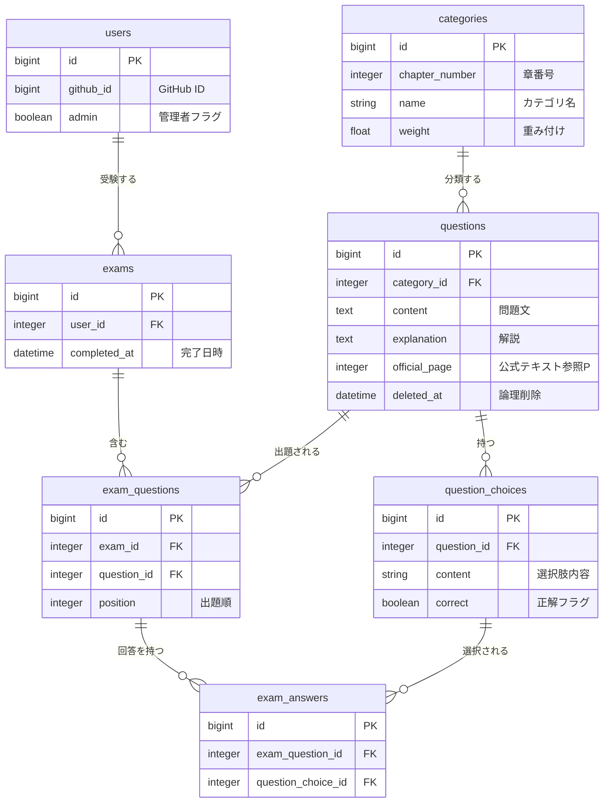
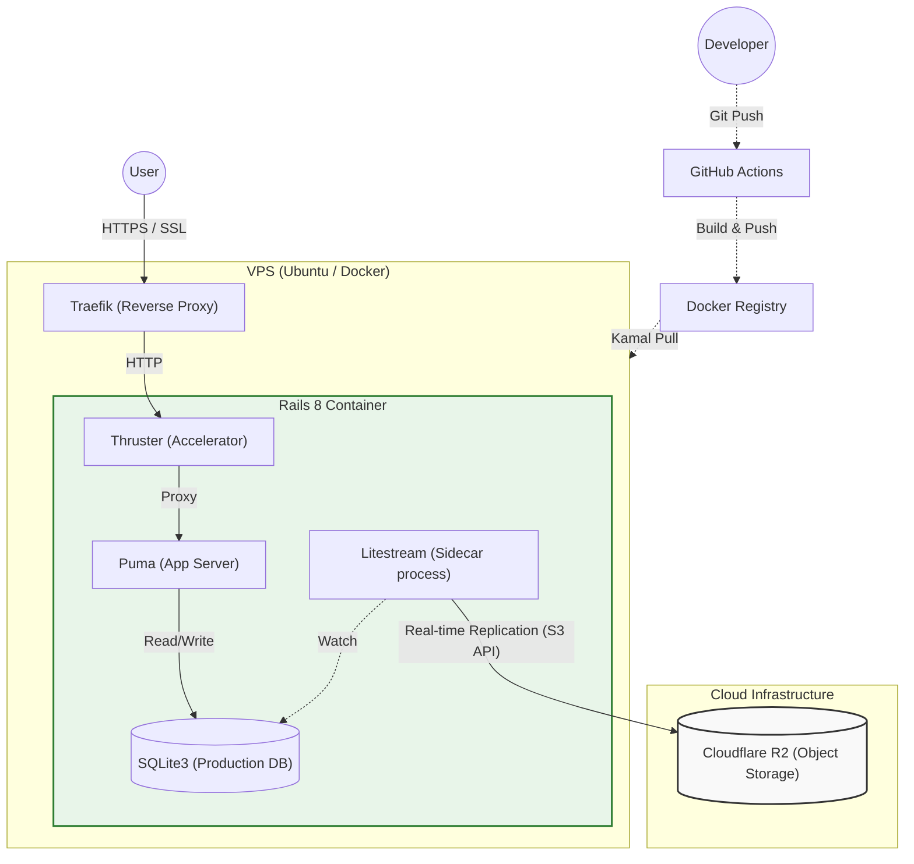

[](https://github.com/php8-study/php8-study-app/actions/workflows/ci.yml)
[](https://github.com/php8-study/php8-study-app/actions/workflows/deploy.yml)


# PHP8技術者認定初級試験スタディ


## 概要
PHP8技術者認定初級試験スタディはPHP8技術者認定初級試験を受験する人に向けた、学習サポートアプリです。

## 特徴
PHP8技術者認定初級試験の公式認定教材である 独習PHP 第4版 の解説内容を参考に200問以上の問題を学習することが出来ます。

* **ランダム演習**: 全問題からランダムに出題され、手軽に学習できます。
* **模擬試験**: 実際の試験と同じ配分・問題数で出題されます。
* **成績管理**: 模擬試験の受験結果や履歴を記録・管理できます。
* **管理機能**: 管理者は問題・カテゴリーを作成、変更、削除することができます。

※ 本アプリは非公式ツールです。

## URL
https://php8-study.jp

## デモ

### ランダム問題
https://github.com/user-attachments/assets/1b05f476-4551-42c1-b7f9-85b920c3c249

### 模擬試験
https://github.com/user-attachments/assets/2051db71-0492-4c33-b9a7-061a5f78372e

### 管理者画面
https://github.com/user-attachments/assets/9986f016-1afd-4219-b778-0e33c8a8ce4a

## 環境構築
以下の手順でローカル環境を構築できます。

1. リポジトリのクローンとセットアップ
```bash
$ git clone https://github.com/php8-study/php8-study-app.git
$ cd php8_study
$ bin/setup
```

2. 環境変数の設定(GitHub OAuth)
本番環境では GitHub OAuth を使用してログインを行います。
`.env` ファイルを作成し、GitHub Developer Settings で取得した以下のキーを設定してください。
```bash
GITHUB_KEY=your_client_id
GITHUB_SECRET=your_client_secret
```

3.アプリケーションの起動
```bash
$ bin/dev
```

## 開発環境での利用
**開発用ログイン (認証バイパス)**

開発環境においては、GitHub連携を行わずにワンクリックでログインできる開発者ツールが実装されています。
1. `bin/dev`でサーバーを起動し、`http://localhost:3000/`にアクセスします。
2. **画面最下部に固定表示されている黒いバー**を確認してください。
3. 「👑管理者」または「👤一般」をクリックすると、それぞれの権限で即座にログインできます。

* 動作確認の際はこちらの使用を推奨します。

## Lint & Test
1. Lintを実行する
```bash
$ bin/lint
```
2. テストを実行する
```bash
$ bundle exec rspec
```

## 技術スタック
#### バックエンド
* Ruby 3.4.7
* Ruby on Rails 8.1.1
* SQlite 3.51.1

#### フロントエンド
* Hotwire (Turbo / Stimulus)
* ViewComponent
* Tailwind CSS

#### データベース
* SQlite

##### テスト
* RSpec
* FactoryBot
* Capybara

## ER図


## インフラ構成
Kamalを使用し、VPS上にコンテナベースでデプロイしています。
Rails 8 の標準機能を活用した、SQLiteベースのシングルサーバー構成です。
低価格で信頼性のある構成を目指しました。

### 技術スタック
* **Deployment**: Kamal (Docker on Ubuntu VPS)
* **Web Server**: Puma + Thruster (HTTP/2, Caching)
* **Database**: SQLite3
* **Backup**: Litestream + Cloudflare R2 (リアルタイムレプリケーション)
* **Reverse Proxy**: Traefik (SSL自動化)


